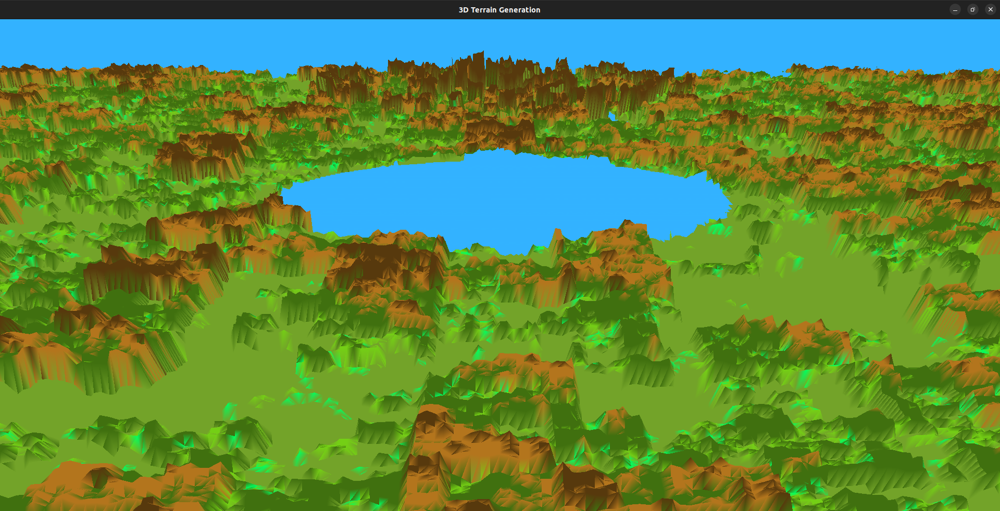
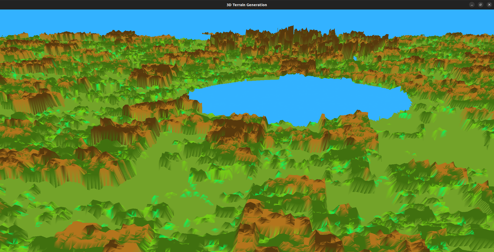
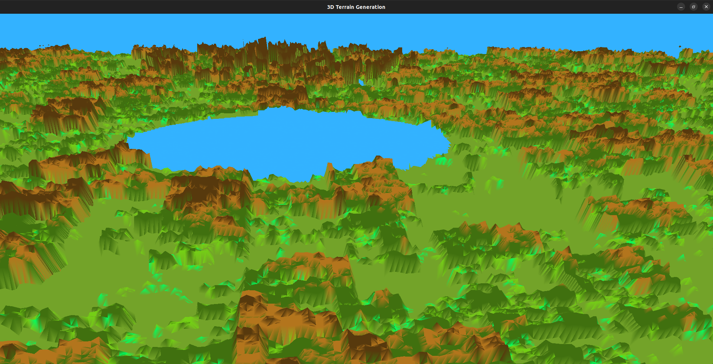
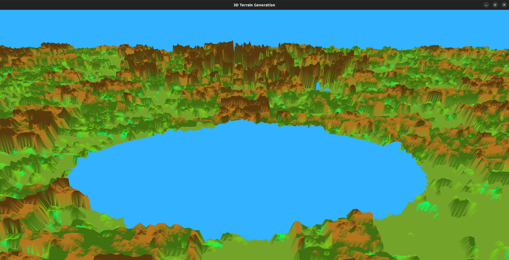
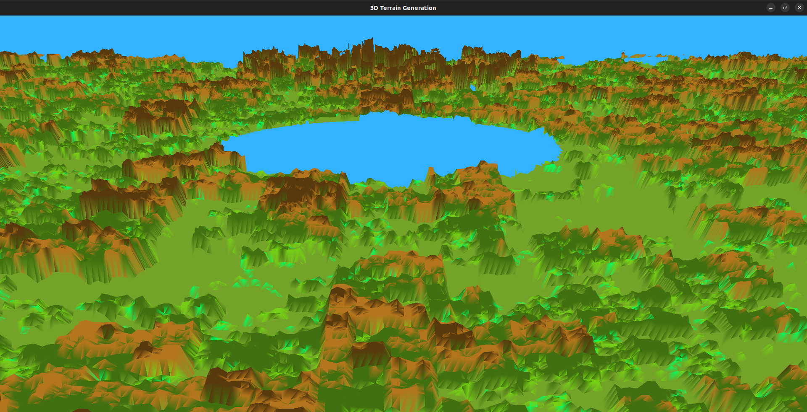
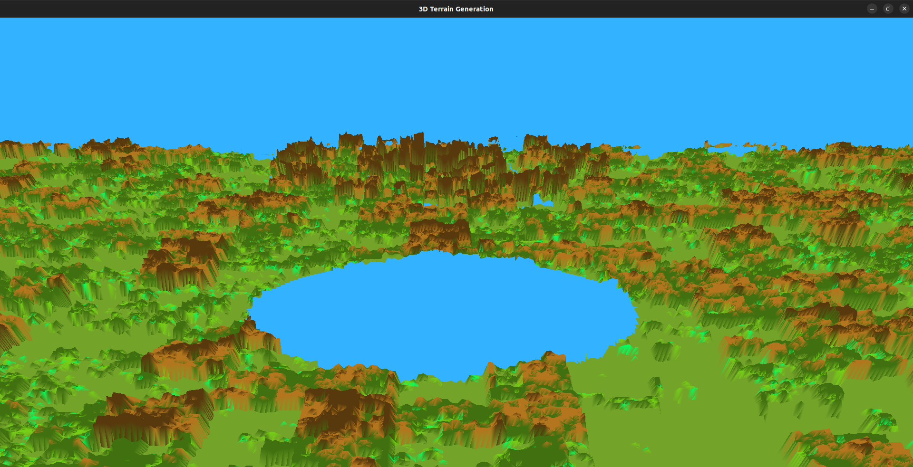
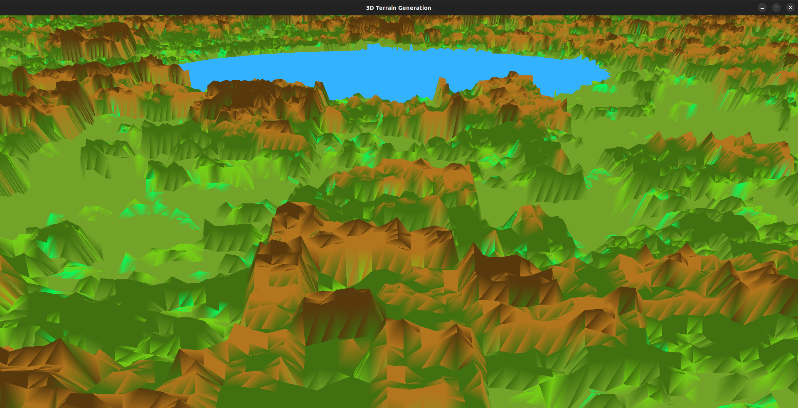

# Acknowledgments
We would like to thank Prof. Tathagata Ray and Prof. Sumanta for providing us with an opportunity to explore the OpenGL libraries while also helping us in building a valuable project in the form of a 3D Procedural Terrain Model.

# Introduction
As part of this project, we generated a 3D Procedural Terrain Model using Perlin Noise containing trees and a lake along with functionalities to look around, move forward and backward, move left and right, and also move up and down to explore the world.

# Screenshots

*A Normal View of the terrain*

*A view when looking left in the terrain*

*A view when looking right in the terrain*

*A view when moved front in the terrain*

*A view when moved back in the terrain*

*A view when moved up in the terrain*

*A view when moved down in the terrain*

# Controls
- `+` to move forward
- `-` to move backward
- `Up_Arrow_Key` to move up
- `Down_Arrow_Key` to move down
- `Left_Arrow_Key` to move left
- `Right_Arrow_Key` to move right
- `y` to look left from the same position
- `Y` to look right from the same position

# Future Works
In our future development plans, we aim to enhance the aesthetics of the 3D terrain by incorporating additional elements into the world. Some of the enhancements include:

- **River Integration:** Introducing a river that flows through the terrain.

- **Mountain Landscape:** Incorporating mountains to the landscape, enhancing the overall topography.

- **Clouds and Sun in the Sky:** Introducing clouds and the sun to the sky.

These additions will not only expand the scope of the project but also contribute to a more immersive and visually engaging 3D world.

# Team Members
- Saurabh K Atreya
- Pritam Basu
- Vamsi Krishna Gattupalli

